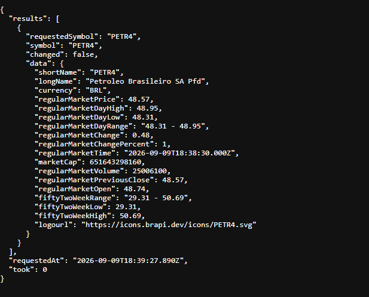
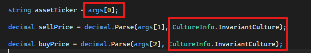
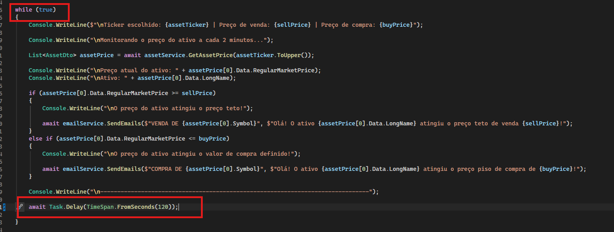
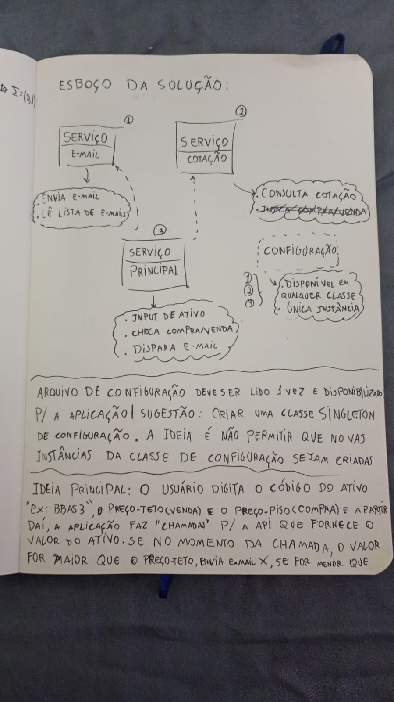

# Qual é o objetivo do desafio? 

O desafio em questão visa a criação de uma aplicação simplificada que monitora a cotação de algum ativo listado na B3 (ex: BBAS3) via API, e envio de e-mail para uma lista de destinatários, informando que o preço atingiu um "teto" ou um "piso". O ativo, e os preços teto e piso são informados pelo usuário. 

#### O que é o "piso" e "teto" ?
São, respectivamente, o preço de "compra" e o preço de "venda". A ideia é que caso o preço do ativo atinga um determinado valor, a aplicação envia um e-mail informando que talvez seja uma boa oportunidade de comprar ou de vender.

#### Ideia de arquitetura/organização
Até o momento da minha análise, dividi a aplicação em 3 partes principais: E-mail, Cotação e Código Principal. A ideia é fazer separar e focar individualmente, para fazer um código melhor e organizado e depois juntar tudo sob a lógica principal.

- **E-mail:**
Serviço de envio de e-mail, a ideia é que ele envie os e-mails para a lista de destinatários e nada além disso. O conteúdo da mensagem e o título vão ficar no código principal. Até o momento estou organizando dessa forma.

- **Cotação:**
A ideia desse serviço é encapsular a lógica de obtenção de dados dos ativos escolhidos, trazendo o valor da cotação.

- **Código Principal:**
Aqui fica a lógica principal da aplicação do desafio, contendo validação dos inputs e lógica de monitoração dos preços dos ativos.

### Decisões: 
Essa seção tem como objetivo trazer mais clareza sobre o uso de IA nesse desafio, mostrando onde e como foi utilizada.

- **Classe de Configuração:**
Um dos requisitos do projeto é que tenha um arquivo de configuração para armazenar a lista de e-mails e configurações de SMTP para envio das mensagens por e-mail. Na minha concepção, não faz sentido um arquivo ou classe de configuração poder ser instanciada várias vezes, tendo em vista que isso pode gerar inconsitências nos dados (alguma parte do código pode ler um valor X enquanto outra pode ler Y, caso exista mais de uma instância). Com isso em mente, implementei o padrão SINGLETON, baseado no exemplo do [Refactoring Guru](https://refactoring.guru/pt-br/design-patterns/singleton/csharp/example). Adicionalmente, criei um arquivo json chamado "appsettings.json" contendo as informações de configuração, que é lido pela classe "Configuration" e posteriormente é acessada por outras partes do código.
 
- **Serviço de E-mail** 
Me baseei em dois vídeos tutoriais sobre envio de e-mail em C#: [Link 1](https://www.youtube.com/watch?v=tCGHKXfMlss) e [Link 2](https://www.youtube.com/watch?v=lCHKwyekbT4)

- **Serviço de Consulta de Cotação**
Pesquisei APIs que fornecem valor de cotações e achei uma chamada ["Brapi"](https://brapi.dev/), que fornece chamadas gratuitas para 4 ativos (PETR4, MGLU3, VALE3 e ITUB4). Analisei o retorno do endpoint https://brapi.dev/api/v2/stocks/quote?symbols=CÓDIGO_DO_ATIVO e criei um DTO (Data Transfer Object) para lidar com o retorno da API e utilizar os dados, me baseando na [documentação da API](https://brapi.dev/docs)

O DTO criado se chama BrapiAssetDto e nele está mapeado 3 campos: preço do ativo, nome do ticker e nome completo da empresa. Apesar do endpoint retornar muitos campos, só utilizei 3 para âmbito de simplificação.

Utilizei a documentação da própria Microsoft para criação do serviço de obtenção de preço https://learn.microsoft.com/en-us/dotnet/fundamentals/networking/http/httpclient e o ChatGPT para organizar e explicar onde o objeto HttpClient deveria ser chamado.

##### Retorno do endpoint utilizado:

- **Código Principal**
Coloquei aqui a lógica principal do desafio, como validação de inputs e tempo de monitoração. Criei algumas validações em cima dos inputs, para verificar valores de preços de compra e venda visando barrar valores negativos ou preço de compra maior que preço de venda (coloquei essa validação porque pra mim não faz sentido um preço de compra ser maior que preço de venda). Adicionalmente adicionei uma validação em cima do código do ativo, tendo em vista que o usuário pode digitar só letras minúsculas, só maiúsculas ou ambas, então coloquei uma validação que torna agnóstico esse ponto, aí o código só se importa com o nome correto do ticker do ativo.

Coloquei outra validação para impedir que o usuário digite um código que não esteja na lista (ITUB4, VALE3, MGLU3 ou PETR4), tendo em vista que a versão gratuita do Brapi não permite a consulta de outros tickers além desses.

Nesse trecho do código, o valor "args[número]" é referente aos argumentos na hora de executar o programa. Ex: dotnet run **VALE3 20.6 19.5** o args[0] é o ticker, args[1] é o preço de venda e args[2] é o preço de compra. E o CultureInfo serve para padronizar o separador das casas decimais, pois em alguns países, como o Brasil o separador é vírgula, enquanto em outros é um ponto. No caso caso o separador foi definido como ponto.

O while true serve para que a aplicação não pare de rodar, a não ser que seja encerrada manualmente. O await Task.Delay foi uma sugestão do próprio copilot, integrado à IDE do Visual Studio, ele serve para substituir o Thread.Sleep, que eu inicialmente utilizaria.

#### Observações sobre o uso de IA
Utilizei a IA pontualmente para tirar dúvidas, como na utilização do Task.Delay ao invés de Thread.Sleep. Fiz um esboço básico de como pensei na solução do problema do desafio, utilizei alguns padrões/boas práticas como a utilização de Singleton na classe de configuração e utilização de Interfaces para melhor controle de responsabilidade das classes de serviço.

